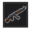

<p align="center">  </p>

<h1 align="center">SimpleGun</h1>
<p align="center">
  
  
  
</p>

<p align="center">
  <a href="https://modrinth.com/mod/simplegun">
    
  </a>
  <a href="https://github.com/beihaime/SimpleGun/releases">
    
  </a>
</p>
</p>

## Requirements

- Minecraft 1.20.1
- Minecraft Forge 1.20.1 
- Java 17

## Installation

1. Install Forge for Minecraft 1.20.1.
2. Download the latest `.jar` from [Releases](https://github.com/beihaime/SimpleGun/releases).
3. Put the file in your `.minecraft/mods` folder.
4. Launch the game with the Forge profile.

## Features

- AK-47 with custom bullet projectiles
- Rocket projectile that explodes on impact
- Craftable custom ammunition
- Custom damage handling
- Advancements

## Development

```bash
git clone https://github.com/beihaime/SimpleGun.git
cd SimpleGun
./gradlew build
```
